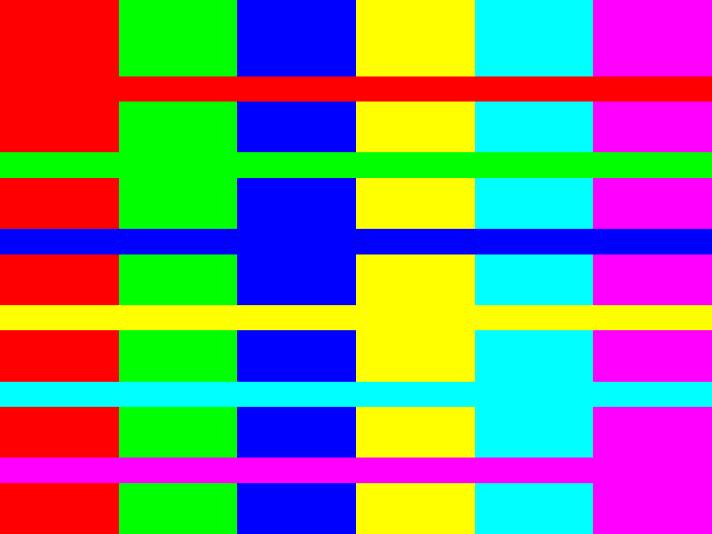
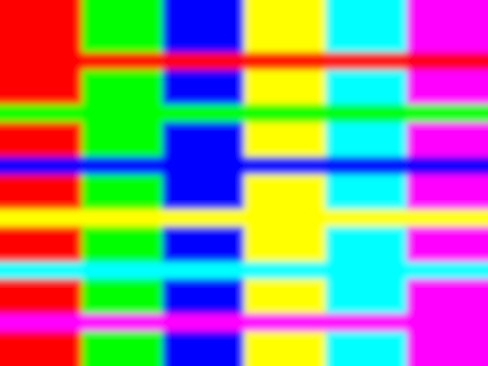
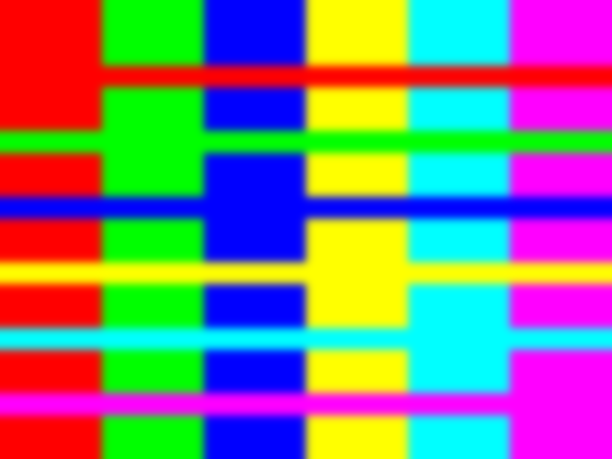

# OF_GammaTests

Testing different approaches to process gamma properly on openFrameworks 

## intro

In short, on electronic devices that either capture or display images, [gamma](https://en.wikipedia.org/wiki/Gamma_correction) is the curve that relates the stored data and the light intensity that it represents. Human beings see in a sort of logarithmic way while electronic devices do it on a more linear fashion, so gamma correction needs to be done.

After reading [this article](https://blog.johnnovak.net//2016/09/21/what-every-coder-should-know-about-gamma/) I realized that openFrameworks was not handling gamma properly and as an extent neither was I. Considering that image processing is an important feature of openFrameworks, processing gamma properly then is an important thing.
This repository contains various test for propper gamma handling, via cpu, gpu (using openGl calls and via custom shaders). also it contains some tests for openCV (for which gamma is handled incorrectly :O )

## Testing
A very simple test in order to see if the gamma is processed correcly is to apply a gaussian blur.

The following test pattern will be used:

If we apply a gaussian blur to it we would expect the following, which is what is achieved when gamma is handled properly

Yet, when gamma is not handled properly you get the following image, with this noticeable darker banding. This is what you currently get in OF when simply applying a gaussian blur, regardless of doing it via cpu, via gpu or via opencv.

